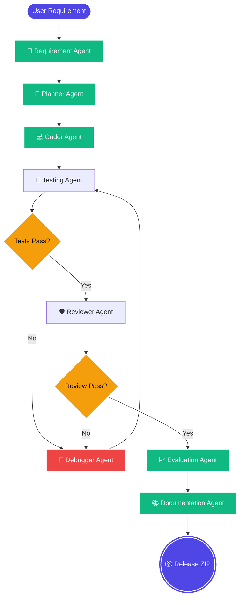

<div align="center">
  
# 🤖 Loop-Based Multi-Agent System for Automated Software Development

**An autonomous, self-correcting AI software factory designed to revolutionize the software development lifecycle.**

This project introduces a stateful, iterative multi-agent architecture built on top of LangGraph. It accepts natural language requirements and orchestrates specialized AI agents (Planner, Coder, Tester, Reviewer, and Debugger) to autonomously generate, test, repair, and package full-stack applications without human intervention until the final approval stage.

[](#)
[](#)
[](#)
[](#)
[](#)

*From natural language requirements to a fully tested, documented, and packaged application—autonomously.*

</div>

---

## 🚀 The Problem & Our Solution

**The Problem:** Traditional "one-shot" LLM code generators fail on complex tasks. They lack the iterative lifecycle of real software development (planning, coding, testing, reviewing, and debugging).

**The Solution:** We replace single-shot generation with a **Stateful, Autonomous Multi-Agent Closed-Loop Feedback System**. By orchestrating multiple specialized AI agents using **LangGraph**, the system iteratively builds, tests, audits, and debugs code until it meets rigorous quality gates.

---

## ✨ Key Features

| Feature | Description |
| :--- | :--- |
| 🧠 **Multi-Agent Orchestration** | Specialized agents handle Requirements, Planning, Coding, Testing, and Reviewing. |
| 🔄 **Self-Correcting Loop** | Built-in debugging loops automatically fix syntax errors, failed tests, and security flaws. |
| ⚡ **Live Preview & Interaction** | Instantly interact with generated frontends running completely serverless via `localStorage`. |
| 📊 **Quality Evaluation** | Automated calculation of test pass rates and requirements coverage. |
| 📦 **Automated Packaging** | Generates complete ZIP distributions with SHA256 checksums ready for release. |
| 📝 **Auto-Documentation** | Generates comprehensive `README`, architecture, API, and setup documentation. |

---

## 🗺️ High-Level Workflow

Below is a simplified view of our Multi-Agent lifecycle. For a deep dive into the architecture, check out [`docs/architecture.md`](docs/architecture.md).



---

## 📂 Project Structure

```text
loop-based-multi-agent/
├── backend/                # FastAPI orchestration backend
│   ├── app/
│   │   ├── agents/         # AI Agent implementations (Planner, Coder, Tester, etc.)
│   │   ├── api/            # REST API Endpoints and routers
│   │   ├── core/           # Environment and configuration settings
│   │   ├── database/       # SQLAlchemy models and engine setup
│   │   ├── execution/      # Sandboxed execution and live runner engine
│   │   ├── schemas/        # Pydantic data validation schemas
│   │   ├── services/       # Core business logic and file managers
│   │   ├── workflow/       # LangGraph state machine definition
│   │   └── main.py         # Application entry point
│   ├── tests/              # Pytest suites for backend logic
│   ├── requirements.txt    # Python dependency manifest
│   └── app.db              # Local SQLite Database
├── frontend/               # React-based UI Dashboard (Vite + Tailwind)
│   ├── src/
│   │   ├── components/     # React UI components (Agent tracking, Modals, etc.)
│   │   ├── services/       # API clients to communicate with backend
│   │   ├── utils/          # Helper functions and formatters
│   │   ├── App.tsx         # Main React Dashboard layout
│   │   └── main.tsx        # Application root entry
│   ├── package.json        # Node.js dependencies
│   └── tailwind.config.js  # Tailwind CSS configuration
├── generated_projects/     # Output directory for autonomously built AI projects
├── docs/                   # Additional documentation and research specs
│   └── architecture.md     # Detailed system design and entity relationship diagrams
├── README.md               # Quick start guide and overview
└── .env                    # Environment variables (API Keys, etc.)
```

---

## 🛠️ Quick Start Guide

Get the AI software factory running on your local machine in minutes.

### 1. Start the Backend

```bash
cd backend
python -m venv venv
# Windows: venv\Scripts\activate | Mac/Linux: source venv/bin/activate
pip install -r requirements.txt
uvicorn app.main:app --reload
```

### 2. Start the Frontend

```bash
cd frontend
npm install
npm run dev
```

### 3. Build Your First App!
Open your browser to `http://localhost:5173`, enter a prompt like *"Build a beautiful Kanban board app"*, and watch the agents go to work!

---

<div align="center">
  <i>Built with ❤️ using LangGraph, FastAPI, and React.</i>
</div>
