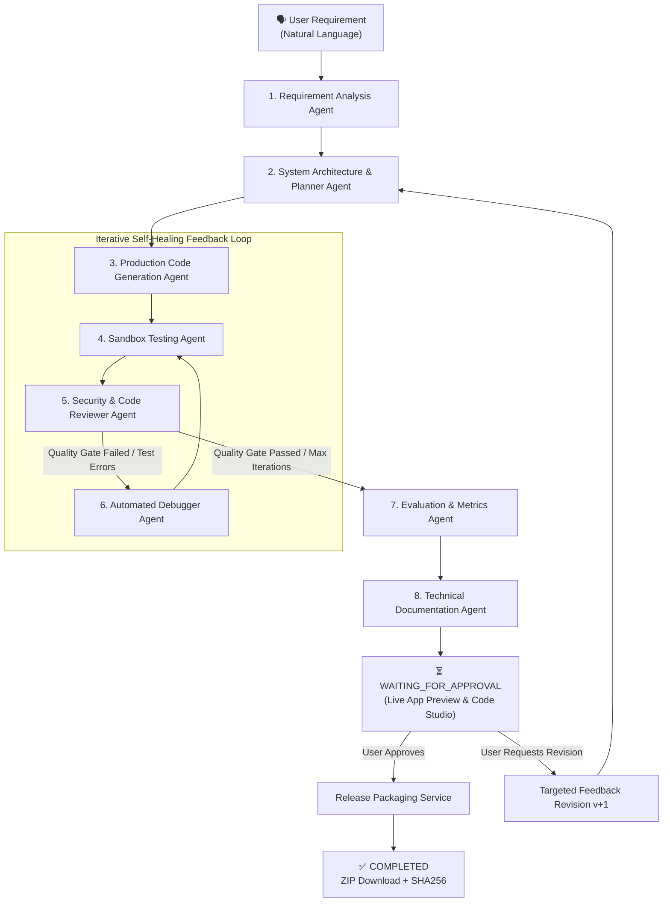

# Architecture Document
## Loop-Based Multi-Agent System for Automated Software Development (Experiment B)

---

## 1. Executive Summary & Proposed Solution

### Problem Context: Limitations of Single-Shot LLM Generation
Traditional AI coding tools utilize single-shot prompting—attempting to generate an entire multi-file software application in a single pass. This suffers from:
1. **Zero Runtime Grounding**: Code is not executed or verified, resulting in runtime exceptions, syntax errors, and missing imports.
2. **Context Degradation & Hallucination**: Complex systems exceed coherent generation limits, omitting critical configuration, database schemas, and style assets.
3. **No Quality or Security Auditing**: Lacks automated scanning for OWASP vulnerabilities or static code analysis.

### The Proposed Solution
This project introduces a **Stateful, Iterative Multi-Agent Closed-Loop Software Engineering System** powered by **LangGraph**. The system replaces monolithic generation by decomposing the software development lifecycle into specialized, cooperative AI agent nodes bound by strict automated quality gates.



### Core Innovations of the Proposed Solution:
- **Autonomous Feedback Loop**: Cyclic routing `Testing -> Reviewer -> Debugger -> Testing` iterates automatically until all test cases pass and security thresholds are met.
- **Full-Stack Resilient Code Synthesis**: Emits complete, production-grade applications with zero placeholder comments, including persistent SQLite databases, FastAPI/Express REST endpoints, Dockerfiles, and interactive client UIs.
- **Dual-Mode Sandbox Execution**: Automatically runs `pytest -v --cov` inside isolated Docker containers or sandboxed subprocesses to extract empirical test pass rates and coverage metrics.
- **Human-in-the-Loop Approval Station**: Incorporates interactive **Live App Preview** (with Desktop/Tablet/Mobile viewports) and **Code Studio** before releasing signed ZIP distribution packages.

---

## 2. High-Level Architecture Overview

The system implements **Experiment B**: a fully autonomous multi-agent pipeline orchestrated with LangGraph, where 8 specialized agent nodes interact over a shared state machine with an automated quality gate loop before reaching the User Approval Station.

---

## 3. Frontend Architecture

**Technology**: React 18 + TypeScript + Vite + Tailwind CSS  
**Entry point**: `frontend/src/main.tsx`  
**Main component**: `frontend/src/App.tsx`

### Key Components

| Component | Responsibility |
|---|---|
| `WorkflowVisualization` | Sidebar stage tracker showing PENDING/RUNNING/COMPLETED/FAILED for each agent step |
| `AgentRunList` | Expandable log of all agent executions with explainability panel |
| `IterationCards` | Visual cards for each Test→Review→Debug loop iteration |
| `EvaluationDashboard` | Full metrics display: requirements, testing, review, security, development |
| `ApprovalPanel` | Polished approval UI with revision feedback, revision counter |
| `CompletedPanel` | Download panel with SHA-256, size, and navigation links |
| `FailedPanel` | Human-readable failure explanation with retry button |
| `VersionHistory` | Factual side-by-side version comparison (no ranking) |
| `CodeExplorer` | File tree + syntax-highlighted content viewer |

### API Service

`frontend/src/services/api.ts` — typed Axios client mapping to all backend REST endpoints.

### Auto-Polling

While a project is in `RUNNING` or `PACKAGING` state, the UI auto-polls the backend every 4 seconds to reflect live agent progress.

---

## 3. Backend Architecture

**Technology**: Python 3.11 + FastAPI + SQLAlchemy + SQLite  
**Entry point**: `backend/app/main.py`

### Directory Structure

```
backend/app/
├── agents/          # Eight specialized LLM agents
├── api/routes/      # FastAPI REST endpoints
│   └── projects.py  # Primary project API (828+ lines)
├── core/
│   ├── config.py    # Pydantic settings from .env
│   ├── llm.py       # LLM client with primary/fallback
│   └── security.py  # safe_join, scan_for_secrets
├── database/
│   ├── database.py  # SQLAlchemy engine + SessionLocal
│   └── models.py    # 14 SQLAlchemy ORM models
├── execution/       # Sandboxed code executor
├── schemas/         # Pydantic request/response schemas
├── services/
│   └── package_service.py  # ZIP creation + secret scanning
└── workflow/
    ├── graph.py     # LangGraph workflow definition
    ├── nodes.py     # Agent node wrappers (DB writes)
    ├── state.py     # TypedDict DevelopmentState
    └── state_machine.py  # Status transition validation
```

---

## 4. Agent Architecture

Each agent is an independent Python class in `backend/app/agents/` with a standard interface:

```python
class AgentName:
    name: str         # Human-readable agent identifier
    
    def execute(self, state: DevelopmentState) -> Dict[str, Any]:
        # 1. Extract context from LangGraph state
        # 2. Build structured LLM prompt
        # 3. Call LLM (primary → fallback on failure)
        # 4. Parse and validate JSON response
        # 5. Return typed result dict
```

### Agent Roster

| Agent | Class | Primary Responsibility |
|---|---|---|
| Requirement Agent | `RequirementAgent` | Extracts functional requirements, acceptance criteria, ambiguities |
| Planner Agent | `PlannerAgent` | Produces architecture, modules, API design, file structure |
| Code Generation Agent | `CodeGenerationAgent` | Generates all project files using safe path writes |
| Testing Agent | `TestingAgent` | Executes tests in sandbox, collects pass/fail metrics |
| Reviewer Agent | `ReviewerAgent` | Reviews code quality, security, and requirement coverage |
| Debugger Agent | `DebuggerAgent` | Fixes issues identified by tester/reviewer using safe_join |
| Evaluation Agent | `EvaluationMetricsAgent` | Aggregates all metrics into a final quality report |
| Documentation Agent | `DocumentationAgent` | Generates README, API docs, architecture notes |

---

## 5. LangGraph Workflow

The workflow is defined in `backend/app/workflow/graph.py` using **LangGraph**.

```
requirement_node
    ↓
planner_node
    ↓
coder_node
    ↓
tester_node ←──────────────────┐
    ↓                          │
reviewer_node                  │
    ↓ (routing_node)           │
    ├── [PASS or max_iter] → evaluator_node
    └── [FAIL + iter < max] → debugger_node ─┘
    
evaluator_node
    ↓
documentor_node
    ↓
[workflow ends, project status = WAITING_FOR_APPROVAL]
```

### State: `DevelopmentState` (TypedDict)

Key state fields passed between nodes:

| Field | Type | Description |
|---|---|---|
| `project_id` | str | Database project identifier |
| `generation_version` | int | Current version number |
| `iteration` | int | Current loop iteration (1-based) |
| `requirements` | dict | Output of RequirementAgent |
| `plan` | dict | Output of PlannerAgent |
| `file_manifest` | list | Files to generate |
| `generated_files` | dict | Generated file contents |
| `workspace_path` | str | Disk path of generated project |
| `test_results` | dict | Output of TestingAgent |
| `review_results` | dict | Output of ReviewerAgent |
| `debug_results` | dict | Output of DebuggerAgent |
| `evaluation_results` | dict | Output of EvaluationAgent |
| `documentation_results` | dict | Output of DocumentationAgent |

---

## 6. State Machine

Defined in `backend/app/workflow/state_machine.py`.

Allowed project-level status transitions:

```
CREATED → RUNNING
RUNNING → WAITING_FOR_APPROVAL | FAILED
WAITING_FOR_APPROVAL → APPROVED | PACKAGING | RUNNING (revision) | FAILED
APPROVED → PACKAGING | COMPLETED | FAILED
PACKAGING → COMPLETED | FAILED
FAILED → RUNNING (retry)
COMPLETED → (terminal)
```

`transition_project_status()` enforces these rules and raises `InvalidTransitionError` for invalid transitions, which is caught in the API routes and logged without silently corrupting state.

---

## 7. Database Architecture

**Database**: SQLite (configurable via `DATABASE_URL`)  
**ORM**: SQLAlchemy  
**Migration**: Auto-create via `Base.metadata.create_all()` on startup

### Entity Relationship Overview

```
Project (1)
  ├── ProjectVersion (many)
  ├── RequirementAnalysis (many, per version)
  ├── DevelopmentPlan (many, per version)
  ├── ProjectFile (many, per version)
  ├── TestResult (many, per version+iteration)
  ├── ReviewResult (many, per version+iteration)
  ├── DebugResult (many, per version+iteration)
  ├── IterationHistory (many, per version+iteration)
  ├── EvaluationResult (one per version)
  ├── DocumentationResult (one per version)
  ├── PackageMetadata (one per version)
  ├── AgentRun (many — one per agent execution)
  ├── WorkflowEvent (many — audit log)
  └── RevisionRequest (many)
```

---

## 8. Sandbox Architecture

Defined in `backend/app/execution/`.

The sandbox **never executes generated code directly on the host process**.

### Execution Modes

| Mode | Description | Isolation |
|---|---|---|
| `docker` | Code runs inside a fresh Docker container, destroyed after execution | Full |
| `subprocess` | Code runs in a spawned subprocess with `EXECUTION_TIMEOUT` | Partial |
| `mock` | Returns synthetic test results without running code | Testing only |

Security controls applied before any execution:
- `safe_join()` validates all file paths (prevents path traversal)
- `scan_for_secrets()` checks content before packaging
- Network access is disabled in Docker sandbox
- Container is destroyed after each run

---

## 9. Version Management

Each user revision creates a **new ProjectVersion** with:
- Incremented `version` number
- `parent_version` pointing to the previous version
- Fresh `workspace_path` (e.g., `generated_projects/{id}/versions/v2/`)
- The previous version's files remain **unchanged** on disk

The `revision_feedback` from the user is injected into the new version's LangGraph state so agents have context for the requested changes.

---

## 10. Approval Workflow

```
Status: WAITING_FOR_APPROVAL
    ↓
User sees: Version, Requirements count, Test summary,
           Review summary, Evaluation quality gate,
           Documentation file count, Revisions used
    ↓
[Approve & Package]         [Request Revision (if revisions remain)]
    ↓                               ↓
status → APPROVED            New ProjectVersion created
    ↓                        revision_count += 1
PackageService.create_package()     ↓
    ↓                        workflow restarts
status → COMPLETED           from RequirementAgent with feedback
ZIP available for download
```

---

## 11. Revision Workflow

1. User submits revision feedback at `POST /api/projects/{id}/revise`
2. Current version's approval_status → `REVISION_REQUESTED`
3. New version (`v+1`) created in database with `parent_version = current`
4. `revision_feedback` stored on new version
5. Project `revision_count` incremented
6. LangGraph workflow launched for new version with feedback injected into state
7. Previous version files remain intact at `versions/v{N}/`

---

## 12. Packaging

`backend/app/services/package_service.py`

Steps:
1. **Secret scan**: `scan_for_secrets()` checks all source files for leaked keys
2. If secrets found → packaging **aborted**, error returned
3. Walk `workspace_path`, excluding: `.env`, `__pycache__`, `node_modules`, `.git`, `*.db`
4. Create ZIP with all files inside `v{N}/` prefix
5. Calculate SHA-256 checksum
6. Write ZIP to `generated_projects/{id}/packages/`
7. Store metadata in `PackageMetadata` table
8. Project status → `COMPLETED`

---

## 13. Security Controls

| Control | Implementation |
|---|---|
| Path traversal prevention | `safe_join()` in `core/security.py` — used in all file writes and API reads |
| Secret detection | `scan_for_secrets()` with regex patterns for API keys, AWS keys, OpenAI keys |
| Code isolation | Sandbox executor prevents generated code from running on host |
| No credential exposure | `.env` excluded from version control; `.env.example` contains only placeholders |
| State integrity | State machine enforces valid transitions; invalid transitions raise `InvalidTransitionError` |
| API path validation | All file-path API endpoints use `safe_join()` before filesystem access |

---

## 14. Error Handling

| Layer | Strategy |
|---|---|
| Agent failures | `try/except` in node wrappers; failed state returned to LangGraph |
| LLM failures | Primary → Fallback LLM automatic retry in `core/llm.py` |
| State transitions | `InvalidTransitionError` logged; FAILED state set without corrupting DB |
| Sandbox timeout | Executor returns error dict; TestingAgent records as test failure |
| Path traversal attempt | `ValueError` raised by `safe_join()`; HTTP 400 returned |
| Secret detection | `ValueError` raised by `PackageService`; packaging aborted |

---

## 15. Observability

### API Endpoints for Research

| Endpoint | Description |
|---|---|
| `GET /api/projects/{id}/report` | Full structured JSON metrics report |
| `GET /api/projects/{id}/report/export` | Downloadable JSON for academic analysis |
| `GET /api/projects/{id}/agents` | All AgentRun records with timing |
| `GET /api/projects/{id}/iterations` | IterationHistory records per version |
| `GET /api/projects/{id}/tests` | All TestResult records |
| `GET /api/projects/{id}/review` | All ReviewResult records |
| `GET /api/projects/{id}/debug` | All DebugResult records |
| `GET /api/projects/{id}/evaluation` | EvaluationResult for current version |
| `GET /api/projects/{id}/versions` | All ProjectVersions with status |

### Metrics Captured Per Run

- Requirement count, acceptance criteria count, ambiguities
- Module count, API endpoint count, implementation steps
- Files generated per version
- Test pass/fail/skip counts per iteration
- Review issue counts (critical/major/minor/security) per iteration
- Debug files modified per iteration
- Total iterations used
- Requirements and acceptance criteria coverage %
- Code coverage % (if available from pytest-cov)
- Final quality gate status (PASS/FAIL)
- Agent execution timestamps (start, end, duration)
- Workflow events audit log

---

*Generated for Experiment B — Loop-Based Multi-Agent System for Automated Software Development*
